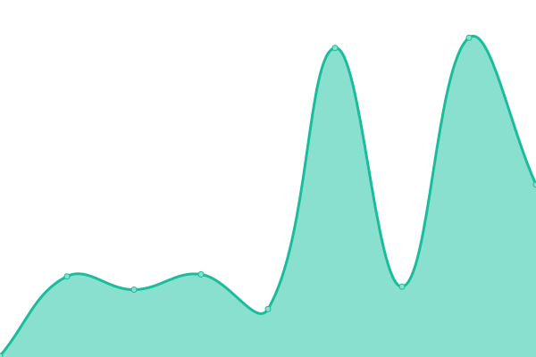

# [📈 Live Status](https://status.plenum.pro): <!--live status--> **🟧 Partial outage**

This repository contains the open-source uptime monitor and status page for [paradixe](https://status.plenum.pro), powered by [Upptime](https://github.com/upptime/upptime).

With [Upptime](https://upptime.js.org), you can get your own unlimited and free uptime monitor and status page, powered entirely by a GitHub repository. We use [Issues](https://github.com/paradixe/plenum-status/issues) as incident reports, [Actions](https://github.com/paradixe/plenum-status/actions) as uptime monitors, and [Pages](https://status.plenum.pro) for the status page.

<!--start: status pages-->
<!-- This summary is generated by Upptime (https://github.com/upptime/upptime) -->
<!-- Do not edit this manually, your changes will be overwritten -->
<!-- prettier-ignore -->
| URL | Status | History | Response Time | Uptime |
| --- | ------ | ------- | ------------- | ------ |
|  [Plenum CRM](https://plenum.pro) | 🟩 Up | [plenum-crm.yml](https://github.com/paradixe/plenum-status/commits/HEAD/history/plenum-crm.yml) | 

 244ms
     
 | 

<a href="https://status.plenum.pro/history/plenum-crm">100.00%</a>
    

|  [Plenum API](https://plenum.pro/api/health) | 🟩 Up | [plenum-api.yml](https://github.com/paradixe/plenum-status/commits/HEAD/history/plenum-api.yml) | 

 0ms
     
 | 

<a href="https://status.plenum.pro/history/plenum-api">100.00%</a>
    

|  [Supabase API](https://supabase.plenum.pro) | 🟥 Down | [supabase-api.yml](https://github.com/paradixe/plenum-status/commits/HEAD/history/supabase-api.yml) | 

 0ms
     
 | 

<a href="https://status.plenum.pro/history/supabase-api">0.00%</a>
    

<!--end: status pages-->

[**Visit our status website →**](https://status.plenum.pro)

## 📄 License

- Powered by: [Upptime](https://github.com/upptime/upptime)
- Code: [MIT](./LICENSE) © [Anand Chowdhary](https://anandchowdhary.com), supported by [Pabio](https://pabio.com)
- Data in the `./history` directory: [Open Database License](https://opendatacommons.org/licenses/odbl/1-0/)
